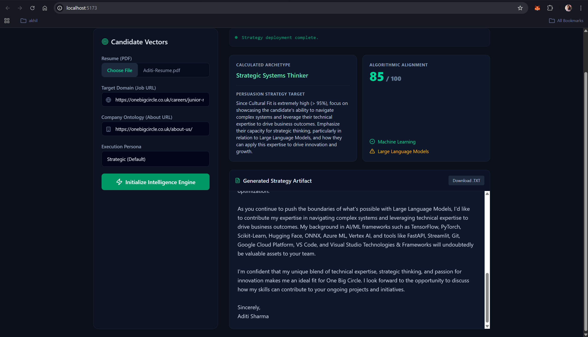

# CareerCompass: Strategic Career Intelligence Engine

<div align="center">
  
  
</div>

CareerCompass (powered by the "Ray" intelligence engine) is a local-first AI career tool designed to analyze candidate resumes against target job descriptions and company ontologies to automatically generate highly strategic, hyper-personalized cover letters and alignment scores.

## 🚀 Project Evolution Journey

This project was built iteratively, completely transforming from a simple synchronous script into a modern, real-time, event-driven architecture. 

### Phase 1: The Monolithic Prototype (Python + Streamlit)
We started with a single `app.py` file using Streamlit. It was simple, but relied heavily on synchronous, blocking HTTP requests to standard web scrapers (like `BeautifulSoup4`) to scrape company data and scrape the job description. The AI generation (via local Ollama Llama 3.1) tied up the whole UI, meaning the user had to stare at a spinning wheel with zero insight into what the agent was actually thinking or doing in the background.

### Phase 2: The Decoupled Architecture (FastAPI + React + Vite)
To create a premium, responsive experience, we ripped the frontend and backend apart:
- **Backend**: We introduced `FastAPI` (in `gateway/main.py`) to handle the heavy lifting asynchronously, allowing the UI to remain snappy.
- **Frontend**: We scaffolded a brand new `Ray Dashboard` using **React, Vite, TypeScript, and TailwindCSS**. We ditched Streamlit's default components for a sleek, dark-themed, glassmorphic UI that looks like a high-end SaaS product.

### Phase 3: Real-Time Streaming (WebSockets)
A static REST API wasn't enough for an AI agent. We wanted the user to see the agent's "thoughts" as it worked. We implemented **WebSockets** in FastAPI so the backend could stream real-time status updates back to the React UI ("Scraping Company Ontology...", "Computing Algorithmic Alignment...", "Anchoring Generative Evidence..."). 

### Phase 4: Advanced Tooling (Model Context Protocol - MCP)
Traditional web scraping (like `BeautifulSoup4`) often fails on modern JavaScript-heavy websites. To make the intelligence engine truly robust, we integrated the **Model Context Protocol (MCP)**. By connecting to the official [Puppeteer MCP Server](https://github.com/modelcontextprotocol/servers/tree/main/src/puppeteer) (`@modelcontextprotocol/server-puppeteer`), our backend can now spin up headless browsers, flawlessly execute JavaScript, and extract the true semantic text of complex target domains that basic scrapers miss.

## 🛠️ Architecture

- **Frontend:** React 19, Vite, Tailwind CSS v4, Lucide Icons, Framer Motion
- **Backend Gateway:** FastAPI, Uvicorn, WebSockets
- **Intelligence Engine:** Local Llama 3.1 via Ollama Python Client
- **Document Loading:** PyPDF2
- **Agent Tooling:** Async BeautifulSoup (Fallback), Model Context Protocol (MCP) via Puppeteer 

## ⚙️ How to Run Locally

### Prerequisites
1. Install [Node.js](https://nodejs.org/) (for the frontend and `npx` MCP server)
2. Install [Python 3.10+](https://www.python.org/)
3. Install [Ollama](https://ollama.com/) and run `ollama pull llama3.1`

### 1. Start the API Gateway (Backend)
Open a terminal and start the FastAPI server:
```bash
# Clone the repository and cd into it
cd CareerCompass
python -m venv .venv
source .venv/bin/activate # Or .venv\Scripts\activate on Windows
pip install -r requirements.txt

# Start the server with Uvicorn
uvicorn gateway.main:app --port 8000 --reload
```

### 2. Start the Ray Dashboard (Frontend)
Open a second terminal and start the Vite development server:
```bash
cd CareerCompass/ray-dashboard
npm install
npm run dev
```

The application will be available at `http://localhost:5173`.

## 🧠 Core Agentic Workflow
1. **Candidate Vectors**: User uploads their PDF resume and provides URLs for the job posting and company about page.
2. **Context Aggregation**: The `scrapers` and `MCP tools` fetch the text.
3. **Structured Extraction**: The LLM extracts specific `skills`, `values`, and `projects` into strict JSON formats.
4. **Algorithmic Alignment**: The LLM computes an alignment score and strategy based on the extracted data.
5. **Generative Artifact**: The agent writes a calculated, highly-targeted letter based directly on the alignment matrix, explicitly avoiding AI fluff and clichés.
